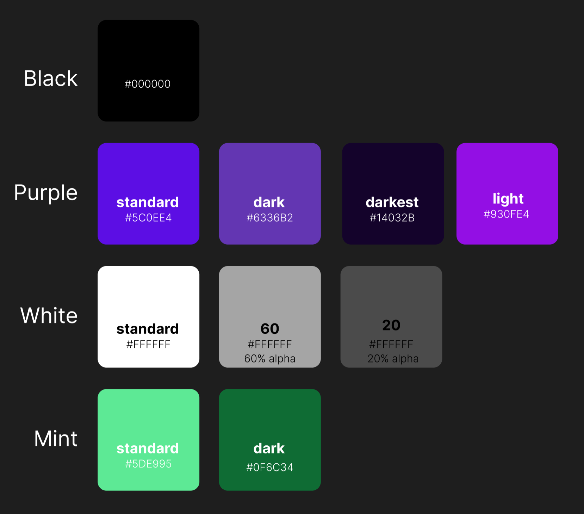

# Design System

## Colors



## Fonts

- [Rubik](https://fonts.google.com/specimen/Rubik)
- [Hanken Grotesk](https://fonts.google.com/specimen/Hanken+Grotesk)
- Reading font: to be determined

## Dimensions

- 12px radius
- 2px highlight size

## Components

For a detailed overview of available components, run:

```bash
npm run storybook
```

## Behaviours & Design Principles

- **Active** vs **Inactive**: this design system will display components differently depending on if they are in a active or inactive state
- Content will be loaded deferred and async when required to drive maximum responsiveness. Kids can be impatient and we need to ensure that any touch results in an instant outcome, even if data may not be available yet
- Components have more than usual spacing between them, as motoric skills of children may not be fully developed and mis-clicking should be avoided. By building distance between interactable components it is ensured that misclicking is reduced.
