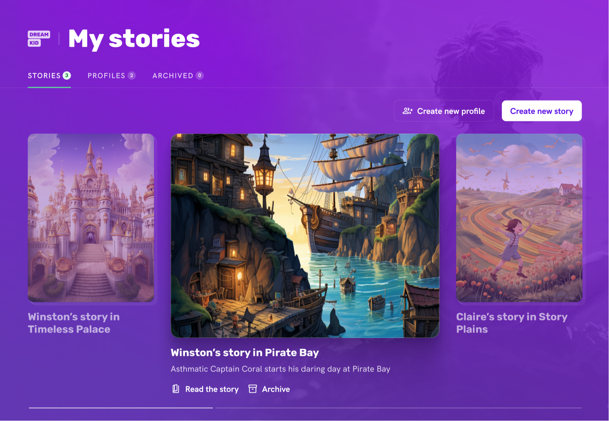
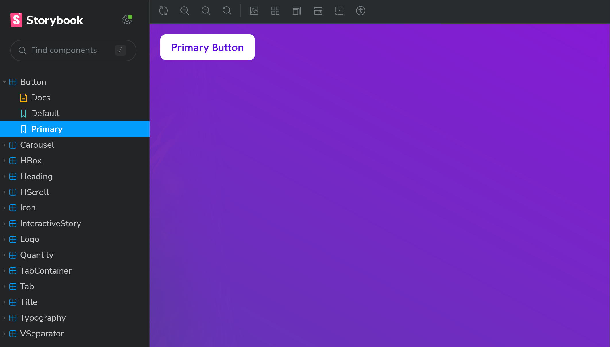

# Dreamkid Design System

An app that revolutionises child books.



_Original design depicted._

## Getting Started

First, run the development server:

```bash
npm run dev
# or
yarn dev
# or
pnpm dev
# or
bun dev
```

Open [http://localhost:3000](http://localhost:3000) with your browser to see the result.

## Storybook



This project uses Storybook. Run the following command to view all available components provided by the design system:

```bash
npm run storybook
```

## Design System

Refer to the [Design System document](DESIGNSYSTEM.md) for details on the design system.
